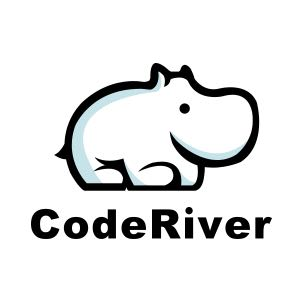
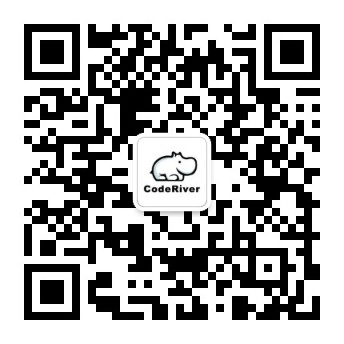

# coderiver 河码



## 项目迁移通知：

团队开发的新版项目迁移至：https://github.com/coderiver-org  
本仓库将继续作为 Solo 的个人仓库使用。

## 微信公众平台
项目的最新进展及形成的各种文档、博客、视频将在官方微信公众平台 `CodeRiver河码` 上首发，欢迎关注。




## 简介

致力于打造全平台全栈精品开源项目，计划做成包含 pc 端（Vue、React）、移动 H5（Vue、React）、ReactNative、Flutter、Android 原生、微信小程序、Angular、Node、java 后端等9种技术栈的全平台型全栈项目，欢迎关注。

coderiver 中文名 河码，是一个为程序员和设计师提供项目协作的平台。无论你是前端、后端、移动端开发人员，或是设计师、产品经理，都可以在平台上发布项目，与志同道合的小伙伴一起协作完成项目。

coderiver 河码 类似程序员客栈，但主要目的是方便各细分领域人才之间技术交流，共同成长，多人协作完成项目。暂不涉及金钱交易。

关于项目一些大家关心的问题的整理：https://shimo.im/docs/7UrBDsLgd8AGeZk4/

更详细的项目介绍：https://shimo.im/docs/MDxvwTXPoK0WiSyL

项目体验地址：http://120.55.60.74   
> 注：项目中所有数据均是 mock 的假数据，并不依赖后端接口。如想登陆，用户名密码输入任何内容或不输入直接点击登陆按钮即可。

## 现状

coderiver 开源后不久就受到了极大的关注，有很多小伙伴想参与进来一起完成项目。  
最近组建了大佬云集的 80 人左右的研发团队，继续朝着打造精品开源项目的目标不懈努力！

目前在优化产品设计，重新设计完成后将拆分 story，然后各技术栈同步开发。

由于忙于组建团队和产品优化设计，项目的原始版本暂停更新。并对原始版本的目录进行了迁移，java项目在目录 `java/original` 中，vue 项目在 `vue/original` 中。在其他分组还未开始开发之前，您还可以下载上述的代码先行学习。后期各版本用的技术栈可能跟现在不一致。  

初版代码中，pc 端用 `Vue` + `Element` 开发接近完成，后端用 `Java` 技术栈的 `SpringCloud` 微服务开发，也接近完成。


## 规划

对项目的规划是做成包含 pc 端（Vue、React）、移动 H5（Vue、React）、ReactNative 混合开发、Android 原生、微信小程序、java 后端的全平台型全栈项目，具体平台和技术实现方案、进度如下表：

| 平台         | 实现方案           | 进度   |
| ------------ | ------------------ | ------ |
| pc 端        | Vue + Element      | 90%    |
| pc 端        | React 技术栈       | 未开始 |
| 移动端 H5    | Vue 技术栈         | 未开始 |
| 移动端 H5    | React 技术栈       | 未开始 |
| 小程序       | Wepy 或 小程序原生 | 未开始 |
| 混合开发     | ReactNative        | 未开始 |
| Android 原生 | 安卓原生开发       | 未开始 |
| 后端         | java + SpringCloud | 80%    |

所有平台，都会用当下最流行最热门的技术方案实现，代码的质量也会尽全力做到最优。

同时也会将关键功能的实现总结到博客里，方便大家学习，欢迎大家关注~

博客地址：https://juejin.im/user/5b06d578f265da0de02f3b0c/posts

## 目录说明（2018-11-25 update）

各个平台的实现都在各自的文件夹里

```
.
├── android
│   └── a-team
├── angular
│   └── a-team
├── flutter
│   └── a-team
├── ios
│   └── a-team
├── java
│   ├── a-team
│   ├── b-team
│   ├── c-team
│   ├── d-team
│   └── original
├── mini-program
│   ├── a-team
│   └── b-team
├── react
│   ├── a-team
│   ├── b-team
│   └── c-team
├── rn
│   └── a-team
└── vue
    ├── a-team
    ├── b-team
    ├── c-team
    └── original
```

可以根据目录拉取自己需要的代码

## 博客汇总

### java 后端

[点赞模块设计 - Redis 缓存 + 定时写入数据库实现高性能点赞功能](https://juejin.im/post/5bdc257e6fb9a049ba410098)

[评论模块 - 后端数据库设计及功能实现](https://juejin.im/post/5be2c213e51d453dfe02d406)

[服务网关 Zuul 与 Redis 结合实现 Token 权限校验](https://juejin.im/post/5bec39206fb9a049e062e4a0)

[评论模块优化 - 数据表优化、添加缓存及用 Feign 与用户服务通信](https://juejin.im/post/5beea202e51d451f5b54cdc4)

### Vue pc 端

[vue + element-ui + scss 仿简书评论模块](https://juejin.im/post/5b41fb58f265da0f6d72b917)

[element-ui 的 Dialog 被蒙板遮住原因及解决办法](https://juejin.im/post/5b3ec5b2f265da0f96286b4f)

---

路漫漫其修远兮，吾将上下而求索。

您的鼓励是我前行最大的动力，欢迎 star，欢迎送小星星 ✨ ~

---

有微信项目讨论群，现在不能扫码入群了，可以加微信申请入群，备注 coderiver

微信号: `douglas1840`
